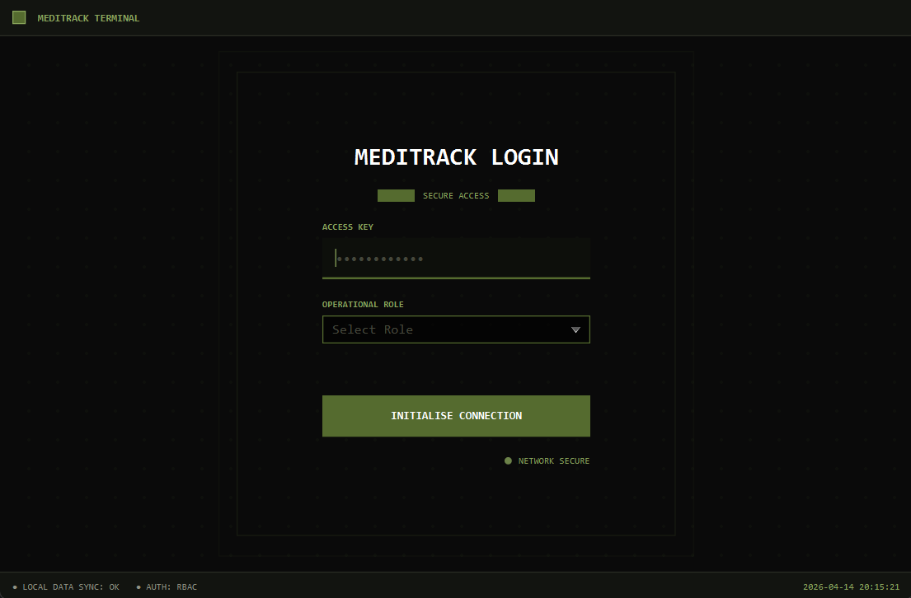

# MediTrack


**MediTrack** is a standalone Java desktop application engineered for military field units. It replaces inefficient paper logs and spreadsheets by centralizing medical supply tracking, personnel readiness monitoring, and duty roster generation.

Designed for high-pressure, austere environments, MediTrack operates completely offline and utilizes strict **Role-Based Access Control (RBAC)** to ensure operators only access data relevant to their specific operational duties.



---

## 🌟 Key Features

* **Strict Role-Based Access Control (RBAC):** Distinct interfaces and permissions for Field Medics, Medical Officers, Platoon Commanders, and Logistics Officers.
* **Smart Duty Roster Generation:** An automated constraint-based scheduling algorithm that guarantees no overlaps and enforces mandatory 8-hour rest periods for personnel.
* **Automated Expiry & Status Tracking:** Real-time tracking of expiring medical supplies and auto-reverting of temporary medical statuses (e.g., MC, Light Duty).
* **Macroscopic Dashboards:** Role-specific HUDs providing immediate situational awareness of critical supply shortages and personnel deployment readiness.
* **Offline-First Data Persistence:** Zero network dependency. Data is securely and instantly saved to a local JSON file.
* **CSV Export:** Role-filtered CSV exporting for reporting to higher headquarters.

---

## 👥 Operational Roles

MediTrack comes pre-configured with four operational roles for demonstration and evaluation:

| Role | Access Key | Primary Responsibility |
| :--- | :--- | :--- |
| **FIELD MEDIC** | `fm123` | Managing physical supply inventory and reporting field casualties. |
| **MEDICAL OFFICER** | `mo123` | Assessing personnel and assigning medical statuses. |
| **PLATOON COMMANDER** | `pc123` | Managing unit manpower and scheduling duty rosters. |
| **LOGISTICS OFFICER** | `lo123` | Auditing supply levels and generating resupply reports. |

---

## 🚀 Quick Start

### Option 1: Running the Application (End-User)
1. Ensure you have **Java 21** (or above) installed.
2. Download the latest `MediTrack.jar` from the [Releases](../../releases) tab.
3. Open a terminal and run the application:
   ```bash
   java -jar MediTrack.jar
   ```

### Option 2: Building from Source (Developer)
1. Clone the repository:
   ```bash
   git clone [https://github.com/MediTrack-Group8/tp.git](https://github.com/MediTrack-Group8/tp.git)
   cd tp
   ```
2. Build the application using the Gradle wrapper:
   ```bash
   ./gradlew build
   ```
3. Run the application:
   ```bash
   ./gradlew run
   ```

---

## 📖 Documentation

Comprehensive guides are available to help you navigate and develop MediTrack:

- [User Guide](docs/UserGuide.md): Detailed instructions on navigating the application, utilizing role-specific features, and exporting data.
- [Developer Guide](docs/DeveloperGuide.md): In-depth documentation on the N-tier architecture, sequence diagrams, RBAC implementation, and constraint-based algorithms.

---

## 🛠️ Technology Stack

- **Language:** Java 21
- **UI Framework:** JavaFX
- **Build Tool:** Gradle
- **Data Serialization:** Jackson (`jackson-databind`)
- **Security:** jBCrypt (Password Hashing)
- **Testing:** JUnit 5

---

## 👨‍💻 Developer Time-Travel Mode
To facilitate the testing of time-dependent features (like MC expirations or supply expirations) without altering your system clock, MediTrack includes a hidden developer tool.

1. Press `Ctrl + Shift + D` inside the application.
2. Click **TIME TRAVEL (DAYS)** and input a number to fast-forward the application's internal clock.