# MediTrack Developer Guide

## Table of Contents
1. [Setting Up](#1-setting-up)
2. [Design](#2-design)
   - 2.1 [Architecture](#21-architecture)
   - 2.2 [UI Component](#22-ui-component)
   - 2.3 [Logic Component](#23-logic-component)
   - 2.4 [Model Component](#24-model-component)
   - 2.5 [Storage Component](#25-storage-component)
   - 2.6 [Common Classes](#26-common-classes)
3. [Implementation](#3-implementation)
   - 3.1 [Add Supply Feature](#31-add-supply-feature)
   - 3.2 [RBAC Enforcement](#32-rbac-enforcement)
   - 3.3 [Status Expiry Auto-Revert](#33-status-expiry-auto-revert)
   - 3.4 [Duty Roster Auto-Generation](#34-duty-roster-auto-generation)
   - 3.5 [Data Persistence](#35-data-persistence)
   - 3.6 [CSV Export](#36-csv-export)
4. [Testing](#4-testing)
5. [Adding New Features](#5-adding-new-features)
6. [Appendix A: Target User Profile and Value Proposition](#appendix-a-target-user-profile-and-value-proposition)
7. [Appendix B: User Stories](#appendix-b-user-stories)
8. [Appendix C: Use Cases](#appendix-c-use-cases)
9. [Appendix D: Non-Functional Requirements](#appendix-d-non-functional-requirements)
10. [Appendix E: Glossary](#appendix-e-glossary)
11. [Appendix F: Manual Testing Instructions](#appendix-f-manual-testing-instructions)

---

## 1. Setting Up

### Prerequisites

| Tool       | Version   | Notes                              |
|------------|-----------|------------------------------------|
| JDK        | 21+       | Required by `sourceCompatibility`  |
| Gradle     | 9.0.0     | Wrapper included (`./gradlew`)     |
| IDE        | Any       | IntelliJ IDEA recommended          |

### First-Time Setup

1. Clone the repository and navigate to the project root.
2. Run `./gradlew build` to compile and verify.
3. Run `./gradlew run` to launch the application.
4. Run `./gradlew test` to execute the full test suite.

### IDE Configuration (IntelliJ IDEA)

1. Open the project as a Gradle project (`File > Open > select tp/build.gradle`).
2. Ensure Project SDK is set to JDK 21.
3. Gradle will auto-import JavaFX modules (`javafx.controls`, `javafx.fxml`, `javafx.graphics`).
4. Mark `src/main/java` as Sources Root and `src/test/java` as Test Sources Root if not auto-detected.

### Key Dependencies

| Library                     | Purpose                                      |
|-----------------------------|----------------------------------------------|
| `jackson-databind 2.15.2`   | JSON serialization/deserialization            |
| `jackson-datatype-jsr310`   | Java 8+ date/time support for Jackson         |
| `jbcrypt 0.4`               | BCrypt password hashing                       |
| `junit-jupiter 5.10.0`      | Unit testing framework                        |

---

## 2. Design

### 2.1 Architecture

The following diagram gives a high-level overview of MediTrack's architecture:


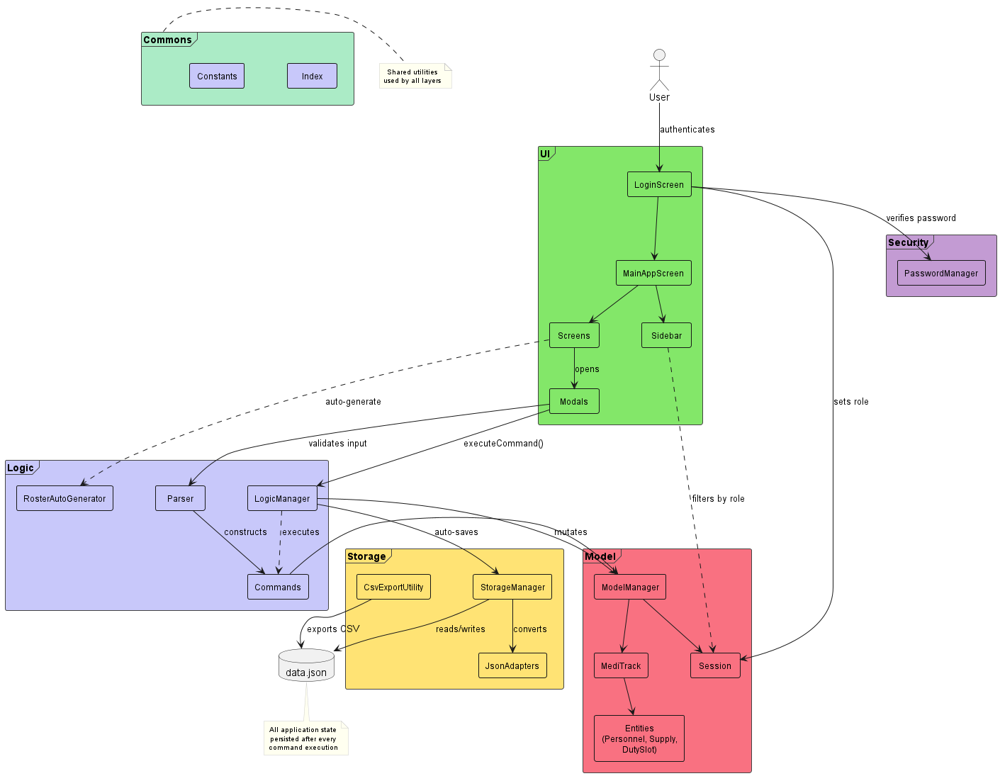

**Key constraint:** Each layer may only depend on the layer directly below it. The UI never accesses Storage directly; the Model never calls Logic. The **Commons** package contains utility classes (e.g., `Index`, `Constants`) used across all components.

Each component:
- Defines its API as a Java **interface** (e.g., `Logic`, `Model`, `Storage`).
- Implements the interface in a `*Manager` class (e.g., `LogicManager`, `ModelManager`, `StorageManager`).
- This allows other components to depend on the abstraction rather than the concrete implementation.

The following sequence diagram shows the high-level interaction between components when the user adds a supply:

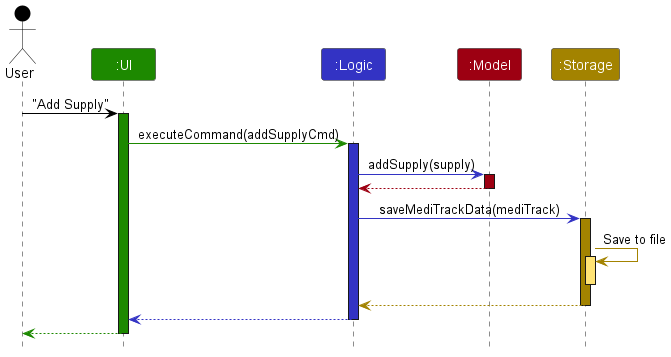

---

### 2.2 UI Component

**Package:** `meditrack.ui`, `meditrack.ui.screen`, `meditrack.ui.modal`, `meditrack.ui.sidebar`

The class diagram below shows the structure of the UI component:

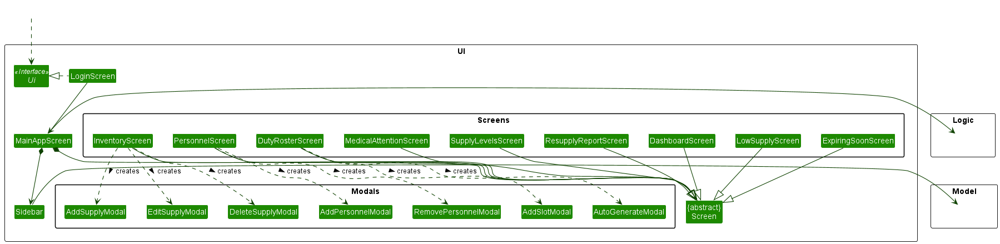

**How the UI works:**

1. `LoginScreen` authenticates the user and sets `Session.role` via `Model.setRole()`.
2. `MainAppScreen` initializes the `Sidebar`, which dynamically shows only the screens the current role can access.
3. Each screen reads data from the `Model` through `ObservableList` bindings, when the Model changes, the UI updates automatically (Observer pattern via JavaFX).
4. When the user triggers an action (e.g., clicks "+ ADD"), the relevant modal collects input, calls `Parser.validate()`, constructs a `Command` object, and passes it to `LogicManager.executeCommand()`.

---

### 2.3 Logic Component

**Package:** `meditrack.logic`, `meditrack.logic.commands`, `meditrack.logic.parser`

**API:** [`Logic.java`](../src/main/java/meditrack/logic/Logic.java)

The class diagram below shows the structure of the Logic component:

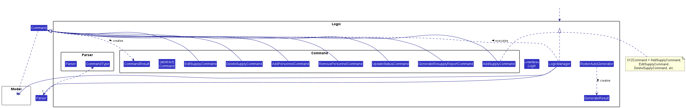

**How the Logic component works (e.g., `AddSupplyCommand`):**

1. The UI calls `Parser.validate(CommandType.ADD_SUPPLY, fields)` to validate raw input.
2. If valid, the UI constructs an `AddSupplyCommand` with the parsed values.
3. The UI calls `LogicManager.executeCommand(command)`.
4. `LogicManager` checks `command.getRequiredRoles()` against `Session.getRole()` (RBAC enforcement).
5. If authorized, `LogicManager` calls `command.execute(model)`, which mutates the Model.
6. `LogicManager` calls `storage.saveMediTrackData()` to persist the updated state.
7. A `CommandResult` with a success/failure message is returned to the UI.

Each `Command` subclass declares its permitted roles:

| Command                        | Allowed Roles                        |
|--------------------------------|--------------------------------------|
| `AddSupplyCommand`             | FIELD_MEDIC, LOGISTICS_OFFICER       |
| `EditSupplyCommand`            | FIELD_MEDIC, LOGISTICS_OFFICER       |
| `DeleteSupplyCommand`          | FIELD_MEDIC, LOGISTICS_OFFICER       |
| `AddPersonnelCommand`          | MEDICAL_OFFICER, PLATOON_COMMANDER   |
| `RemovePersonnelCommand`       | MEDICAL_OFFICER, PLATOON_COMMANDER   |
| `UpdateStatusCommand`          | MEDICAL_OFFICER, FIELD_MEDIC         |
| `GenerateResupplyReportCommand`| LOGISTICS_OFFICER                    |
| `GenerateRosterCommand`        | PLATOON_COMMANDER                    |

The `RosterAutoGenerator` is a standalone utility class used by `AutoGenerateModal` and it does not go through the `Command` pipeline because it produces multiple `DutySlot` objects that are added to the model in batch.

---

### 2.4 Model Component

**Package:** `meditrack.model`

**API:** [`Model.java`](../src/main/java/meditrack/model/Model.java)

The class diagram below shows the structure of the Model component:

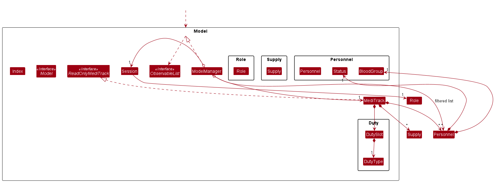

Key design points:

- `Model` interface acts as a **Facade** over the internal data structures. External components interact with this single API.
- `MediTrack` is the root data container. It stores supplies and personnel in `ObservableList` collections (for automatic JavaFX UI binding) and duty slots in a plain `List`.
- `ReadOnlyMediTrack` is a read-only interface that `MediTrack` implements. The Storage layer only receives this interface, preventing accidental model mutation during serialization.
- `Session` holds the active `Role`. It is owned by `ModelManager` to improve testability.
- **Identity:** `Personnel` equality is case-insensitive name only. `Supply` equality is case-insensitive name only. `DutySlot` equality checks all fields.
- **Index convention:** `Index` class converts between 0-based (internal) and 1-based (UI display) indices via factory methods `fromZeroBased()` and `fromOneBased()`.

**Enumerations:**

| Enum        | Values                                               |
|-------------|------------------------------------------------------|
| `Role`      | FIELD_MEDIC, MEDICAL_OFFICER, PLATOON_COMMANDER, LOGISTICS_OFFICER |
| `Status`    | PENDING, FIT, LIGHT_DUTY, MC, CASUALTY               |
| `DutyType`  | GUARD_DUTY, MEDICAL_COVER, PATROL, STANDBY, SENTRY   |
| `BloodGroup`| A_POS, A_NEG, B_POS, B_NEG, AB_POS, AB_NEG, O_POS, O_NEG, UNKNOWN |

---

### 2.5 Storage Component

**Package:** `meditrack.storage`

**API:** [`Storage.java`](../src/main/java/meditrack/storage/Storage.java)

The class diagram below shows the structure of the Storage component:

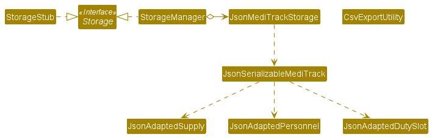

The Storage component:
- Saves and loads `MediTrack` data in JSON format via Jackson `ObjectMapper`.
- Uses the **Adapter pattern**: each domain object (`Supply`, `Personnel`, `DutySlot`) has a corresponding `JsonAdapted*` class with `fromModelType()` and `toModelType()` conversion methods.
- `toModelType()` validates data during deserialization. Corrupt individual records are skipped with a warning to `stderr`, preventing total application failure from a single bad entry.
- `CsvExportUtility` generates role-filtered CSV exports to an `exports/` directory.
- `StorageStub` is a no-op implementation used for test isolation.

---

### 2.6 Common Classes

**Package:** `meditrack.commons.core`, `meditrack.security`

| Class            | Responsibility                                                       |
|------------------|----------------------------------------------------------------------|
| `Index`          | Type-safe wrapper for 0-based / 1-based index conversion             |
| `Constants`      | Application-wide thresholds (`EXPIRY_THRESHOLD_DAYS = 30`, `LOW_STOCK_THRESHOLD_QUANTITY = 50`) |
| `PasswordManager`| Stateless BCrypt hashing (work factor 12) and password verification   |

---

## 3. Implementation

This section describes noteworthy details about how certain features are implemented.

### 3.1 Add Supply Feature

The Add Supply feature illustrates the standard command execution flow used by all commands. The following activity diagram summarizes the decision points:

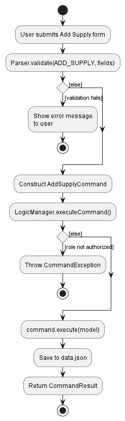

**Step 1:** The user clicks "+ ADD" on the `InventoryScreen`. The `AddSupplyModal` opens.

**Step 2:** The user enters a name, quantity, and expiry date. On submit, the modal calls:

```java
parser.validate(CommandType.ADD_SUPPLY, fields);
```

The `Parser` checks that:
- Name is non-blank.
- Quantity is a positive integer.
- Expiry date is a valid future date in `YYYY-MM-DD` format.

If any check fails, a `ParseException` is thrown with a specific message displayed to the user.

**Step 3:** If validation passes, the modal constructs and executes the command:

```java
Command cmd = new AddSupplyCommand(name, qty, expiryDate);
CommandResult result = logic.executeCommand(cmd);
```

**Step 4:** Inside `LogicManager.executeCommand()`, the following sequence diagram shows the detailed interaction:

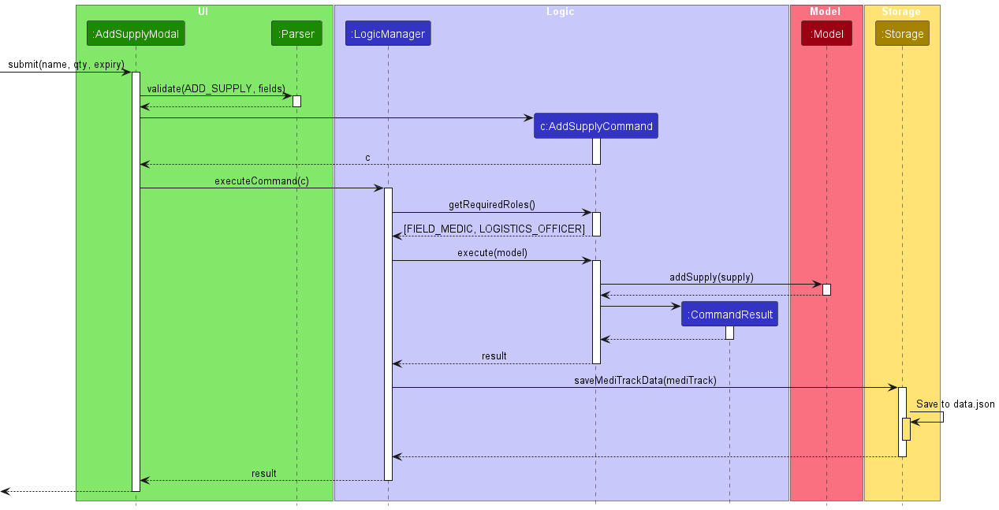

**Step 5:** The `ObservableList<Supply>` in `MediTrack` automatically notifies the bound `TableView`, which refreshes without explicit UI code.

#### Design Considerations

**Aspect: Where to perform input validation**

- **Alternative 1 (chosen):** Validate in `Parser` before constructing the `Command`.
  - Pros: The UI gets a specific, user-friendly error message. Invalid `Command` objects are never created.
  - Cons: Validation logic is split between `Parser` (input format) and `Command.execute()` (business rules).

- **Alternative 2:** Validate inside `Command.execute()`.
  - Pros: All validation in one place.
  - Cons: A `Command` object is constructed with invalid data. Error messages to the UI are less granular.

---

### 3.2 RBAC Enforcement

Role-Based Access Control is enforced at two levels to provide defense in depth.

The following sequence diagram shows how RBAC is enforced inside `LogicManager`:

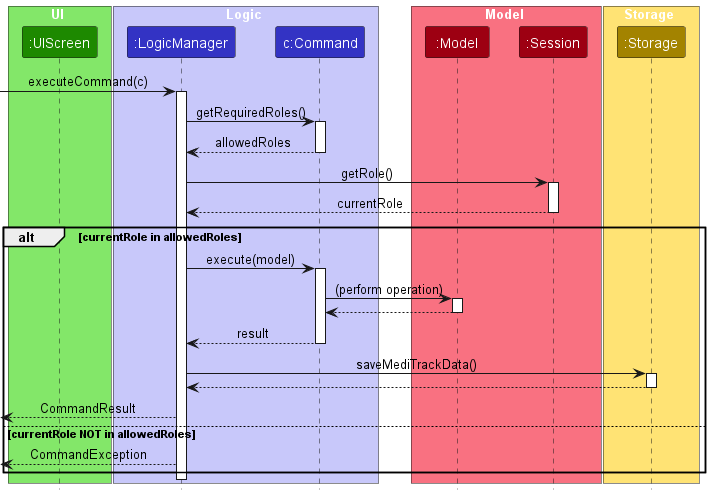

**Level 1 — Logic Layer (authoritative):** `LogicManager.executeCommand()` is the single, authoritative enforcement point. Before calling `command.execute(model)`:

```java
List<Role> allowedRoles = command.getRequiredRoles();
if (allowedRoles != null && !allowedRoles.isEmpty()) {
    Role currentRole = model.getSession().getRole();
    if (currentRole == null || !allowedRoles.contains(currentRole)) {
        throw new CommandException("You do not have permission...");
    }
}
```

Commands that return `null` or an empty list from `getRequiredRoles()` are accessible to all authenticated roles.

**Level 2 — UI Layer (convenience):** The `Sidebar` filters navigation items by `Session.getRole()` so users never see screens they cannot access. This is purely a UX convenience — the Logic layer is the security boundary.

#### Design Considerations

**Aspect: Where to enforce RBAC**

- **Alternative 1 (chosen):** Centralized enforcement in `LogicManager`.
  - Pros: Single point of enforcement. Impossible to bypass by adding new UI paths. Easy to audit.
  - Cons: Requires every `Command` to declare its roles.

- **Alternative 2:** Enforce at the UI level only (hide unauthorized buttons/screens).
  - Pros: Simpler command classes.
  - Cons: A code change that adds a new UI path could accidentally bypass RBAC. No defense in depth.

---

### 3.3 Status Expiry Auto-Revert

When a Medical Officer assigns `MC` or `LIGHT_DUTY` status with a duration (in days), the system sets a `statusExpiryDate` on the `Personnel` record.

**How it works:**

The following sequence diagram shows the `cleanExpiredStatuses()` mechanism:

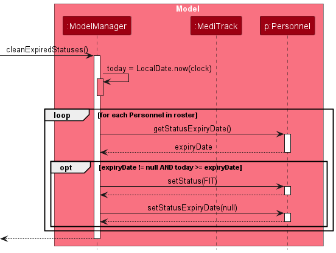

`cleanExpiredStatuses()` is called:
1. In the `ModelManager` constructor (on application startup).
2. Whenever the developer time-travel feature advances the clock.

**Injectable Clock:** `ModelManager` uses `java.time.Clock` for all date calculations. This allows:
- **Unit testing:** Inject a fixed clock (`Clock.fixed(...)`) to test expiry logic deterministically.
- **Developer mode:** The `Ctrl+Shift+D` panel calls `model.setClock(Clock.offset(...))` to advance the application's internal clock without changing the system clock.

#### Design Considerations

**Aspect: When to check for expired statuses**

- **Alternative 1 (chosen):** Check on application startup and on clock change.
  - Pros: Simple. Statuses are always correct when the user sees them. No background threads needed.
  - Cons: If the application runs for multiple days without restart, statuses remain stale until next launch.

- **Alternative 2:** Background timer thread that periodically checks.
  - Pros: Statuses revert in real-time even during long sessions.
  - Cons: Introduces concurrency (thread safety for `ObservableList`), higher complexity for an edge case.

---

### 3.4 Duty Roster Auto-Generation

`RosterAutoGenerator` implements a greedy constraint-based scheduling algorithm. The following sequence diagram shows the auto-generation flow:

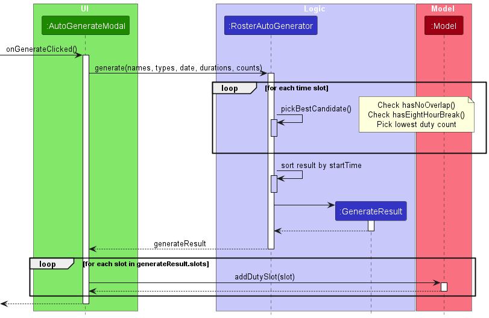

The following state diagram shows how the 8-hour break constraint is verified for each candidate:

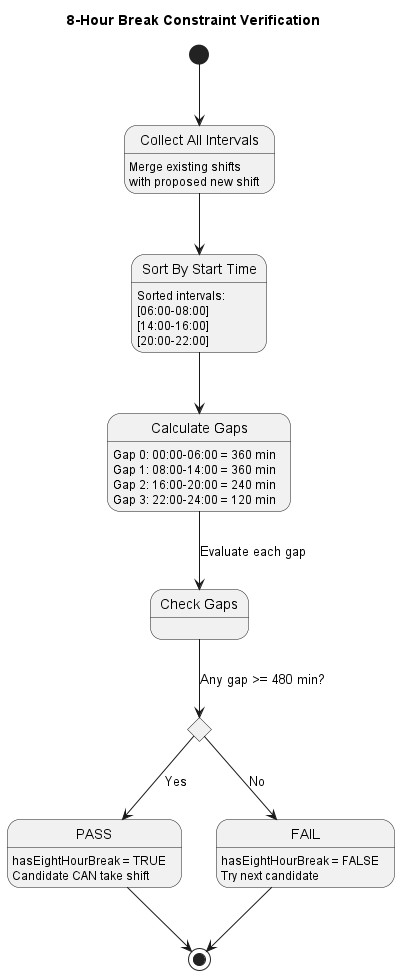

**Constraints:**

| Constraint               | Value       | Description                                       |
|--------------------------|-------------|---------------------------------------------------|
| Minimum break            | 480 min     | 8 continuous hours of rest per person per day      |
| No overlapping shifts    | —           | A person cannot be in two duties simultaneously    |
| Round-the-clock duties   | GUARD_DUTY, PATROL | Scheduled 00:00–24:00; others: 08:00–20:00 |
| Fair rotation            | —           | Candidates with lowest cumulative duty count preferred |

**Algorithm walkthrough (example: scheduling Guard Duty with 120-min slots for 3 personnel):**

```
Step 1: Coverage window = 00:00–24:00 (round-the-clock)
        Slots needed: 12 slots of 120 min each

Step 2: For slot 00:00–02:00:
        Candidates sorted by duty count: [Alice(0), Bob(0), Charlie(0)]
        ✓ Alice has no overlaps, 8-hour break guaranteed → assign Alice
        Alice duty count: 0 → 1

Step 3: For slot 02:00–04:00:
        Candidates sorted: [Bob(0), Charlie(0), Alice(1)]
        ✓ Bob has no overlaps, 8-hour break guaranteed → assign Bob
        Bob duty count: 0 → 1

        ... (continues for all 12 slots, rotating fairly)

Step 4: If a slot cannot be filled (all candidates violate constraints):
        Record "GUARD_DUTY 10:00–12:00" in uncoveredWindows

Step 5: Sort final roster by start time, then by duty type.
```

The result is a `GenerateResult` record containing:
- `List<DutySlot> slots` — successfully scheduled assignments.
- `List<String> uncoveredWindows` — gaps reported to the user.

#### Design Considerations

**Aspect: Scheduling algorithm**

- **Alternative 1 (chosen):** Greedy algorithm — fill slots left-to-right, always pick the least-loaded eligible candidate.
  - Pros: Simple, fast (O(slots * personnel)), produces fair rotations. Deterministic output.
  - Cons: May miss globally optimal solutions in edge cases.

- **Alternative 2:** Constraint solver (e.g., backtracking).
  - Pros: Guarantees optimal assignment.
  - Cons: Far more complex to implement and debug. Overkill for typical roster sizes (< 50 personnel).

---

### 3.5 Data Persistence

**Lifecycle:**

1. **Application start:** `StorageManager.readMediTrackData()` calls `JsonMediTrackStorage.readData()`.
   - If `data.json` is missing → returns `Optional.empty()` → triggers first-launch flow (`FirstLaunchScreen`).
   - If `data.json` exists → Jackson deserializes it into `JsonSerializableMediTrack`.
   - Each `JsonAdapted*` record is converted via `toModelType()`. Corrupt records throw `CommandException` and are skipped (logged to `stderr`).

2. **After every command:** `LogicManager` calls `storage.saveMediTrackData(model.getMediTrack())`, which serializes the entire model to `data.json` via `ObjectMapper.writerWithDefaultPrettyPrinter()`.

**JSON schema:**

```json
{
  "supplies": [
    { "name": "Bandage", "quantity": 100, "expiryDate": "2026-12-01" }
  ],
  "personnel": [
    {
      "name": "SGT Lee",
      "status": "FIT",
      "bloodGroup": "O_POS",
      "allergies": "Penicillin",
      "statusExpiryDate": null,
      "lastModified": "2026-04-10T14:30:00"
    }
  ],
  "dutySlots": [
    {
      "date": "2026-04-12",
      "startTime": "08:00",
      "endTime": "10:00",
      "dutyType": "GUARD_DUTY",
      "personnelName": "SGT Lee"
    }
  ]
}
```

#### Design Considerations

**Aspect: How to handle corrupt records on load**

- **Alternative 1 (chosen):** Skip corrupt records individually and continue loading.
  - Pros: A single bad record does not prevent the application from starting. The user retains all valid data.
  - Cons: The user may not notice a skipped record (warning is only in `stderr`).

- **Alternative 2:** Fail entirely if any record is corrupt.
  - Pros: Data integrity is absolute — no silent data loss.
  - Cons: One corrupt record locks the user out of all their data.

---

### 3.6 CSV Export

`CsvExportUtility.exportData()` generates a role-filtered CSV file.

**What each role can export:**

| Section             | Field Medic | Medical Officer | Platoon Commander | Logistics Officer |
|---------------------|:-----------:|:---------------:|:-----------------:|:-----------------:|
| Personnel Roster    | Yes         | Yes             | Yes               | —                 |
| Duty Roster         | —           | —               | Yes               | —                 |
| Supply Inventory    | Yes         | —               | —                 | Yes               |

**File naming:** `{ROLE}_Export_{yyyyMMdd_HHmmss}.csv`
**Output directory:** `exports/` (auto-created if missing).

---

## 4. Testing

### Test Structure

```
src/test/java/meditrack/
├── commons/core/
│   ├── IndexTest.java
│   └── IndexExtendedTest.java
├── logic/
│   ├── LogicManagerTest.java
│   ├── WorkflowValidationTest.java
│   ├── commands/
│   │   ├── CommandResultTest.java
│   │   ├── CommandResultExtendedTest.java
│   │   ├── GenerateResupplyReportCommandExtendedTest.java
│   │   ├── SupplyCommandsTest.java
│   │   ├── exceptions/
│   │   │   └── CommandExceptionTest.java
│   │   └── personnel/
│   │       ├── AddPersonnelCommandTest.java
│   │       ├── AddPersonnelCommandExtendedTest.java
│   │       ├── RemovePersonnelCommandTest.java
│   │       └── UpdateStatusCommandTest.java
│   └── parser/
│       ├── ParserTest.java
│       ├── RosterAutoGeneratorTest.java
│       ├── exceptions/
│       │   └── ParseExceptionTest.java
│       └── personnel/
│           └── PersonnelParserTest.java
├── model/
│   ├── BloodGroupTest.java
│   ├── DutySlotTest.java
│   ├── DutySlotExtendedTest.java
│   ├── DutyTypeTest.java
│   ├── MediTrackTest.java
│   ├── ModelManagerTest.java
│   ├── ModelManagerExtendedTest.java
│   ├── PersonnelTest.java
│   ├── PersonnelExtendedTest.java
│   ├── RoleTest.java
│   ├── SessionTest.java
│   ├── StatusTest.java
│   ├── SupplyTest.java
│   └── SupplyExtendedTest.java
├── security/
│   └── PasswordManagerTest.java
└── storage/
    ├── CsvExportUtilityTest.java
    ├── JsonAdaptedDutySlotTest.java
    ├── JsonAdaptedDutySlotExtendedTest.java
    ├── JsonAdaptedPersonnelTest.java
    ├── JsonAdaptedPersonnelExtendedTest.java
    ├── JsonAdaptedSupplyTest.java
    ├── JsonAdaptedSupplyExtendedTest.java
    ├── JsonMediTrackStorageTest.java
    ├── StorageManagerTest.java
    └── StorageManagerExtendedTest.java
```

### Test Isolation Techniques

| Technique             | Class                   | Purpose                                              |
|-----------------------|-------------------------|------------------------------------------------------|
| Storage stub          | `StorageStub`           | No-op `Storage` implementation; prevents file I/O in command tests |
| Injectable file path  | `JsonMediTrackStorage`  | Accepts custom `Path`; tests write to temp files     |
| Injectable clock      | `ModelManager.setClock()`| Fixed `Clock` for deterministic date-based testing   |
| Injectable export dir | `CsvExportUtility`      | Custom `Path` for isolated CSV export tests          |

### Running Tests

```bash
./gradlew test                                              # Run all tests
./gradlew test --info                                       # Verbose output
./gradlew test --tests "meditrack.model.ModelManagerTest"    # Specific class
```

### Writing New Tests

- One test class per production class, mirroring the package structure.
- Use **equivalence partitioning** and **boundary value analysis** for test case design.
- Test both positive (valid input) and negative (invalid/edge) cases.
- Use `StorageStub` for any test that invokes `LogicManager`.
- Inject a fixed `Clock` for any test involving dates or expiry logic.

---

## 5. Adding New Features

### 5.1 Adding a New Command

1. Create the command class in `meditrack.logic.commands`, extending `Command`.
2. Implement `execute(Model model)` with the business logic.
3. Implement `getRequiredRoles()` returning the list of authorized roles.
4. Add a `CommandType` enum constant if Parser validation is needed, and add a case in `Parser.validate()`.
5. Create the UI modal/trigger in `meditrack.ui.modal`.
6. Write tests: command test (with `StorageStub`), parser test (if applicable), model test (if new `Model` methods).

### 5.2 Adding a New Role

1. Add a constant to the `Role` enum with a display name.
2. Update `getRequiredRoles()` on existing commands to include or exclude the new role.
3. Add UI screens and sidebar items for the new role's workflows.
4. Update `CsvExportUtility` to define what data the new role can export.
5. Update `LoginScreen` to include the new role.


---

## Appendix A: Target User Profile and Value Proposition

**Target user:** Military field unit staff (Field Medics, Medical Officers, Platoon Commanders, Logistics Officers) operating in austere, offline environments who need to track medical supplies, personnel readiness, and duty schedules.

**Value proposition:** MediTrack replaces paper logs and spreadsheets with a secure, offline desktop application that enforces role-based access control and centralizes supply tracking, personnel status management, and automated duty roster generation.

---

## Appendix B: User Stories

| Priority | As a ...              | I want to ...                                      | So that I can ...                                         |
|:--------:|-----------------------|----------------------------------------------------|-----------------------------------------------------------|
| `***`    | Field Medic           | add, edit, and delete supply items                 | keep the inventory accurate in the field                  |
| `***`    | Field Medic           | see supplies expiring within 30 days               | prioritize consumption before expiry                      |
| `***`    | Field Medic           | flag a soldier as CASUALTY                         | alert the Medical Officer for assessment                  |
| `***`    | Medical Officer       | add personnel with blood group and allergies       | maintain comprehensive medical records                    |
| `***`    | Medical Officer       | assign MC/LIGHT_DUTY with a duration               | have the system auto-revert to FIT when the period ends   |
| `***`    | Medical Officer       | view personnel needing medical attention            | quickly triage non-FIT soldiers                           |
| `***`    | Platoon Commander     | draft new personnel into the system                | build and maintain the unit roster                        |
| `***`    | Platoon Commander     | manually assign duty slots                         | control specific shift assignments                        |
| `***`    | Platoon Commander     | auto-generate a fair duty roster                   | save time and ensure equitable rotation                   |
| `***`    | Logistics Officer     | view supply levels sorted by severity              | identify critical shortages at a glance                   |
| `***`    | Logistics Officer     | generate a resupply report                         | streamline the requisition process to higher HQ           |
| `**`     | any role              | export my authorized data to CSV                   | submit reports to higher headquarters                     |
| `**`     | any role              | see a role-specific dashboard summary              | get a quick operational overview on login                 |
| `*`      | developer             | use Ctrl+Shift+D to time-travel                    | test time-dependent features without changing system clock |

`***` = must have, `**` = nice to have, `*` = unlikely to have (developer-only)

---

## Appendix C: Use Cases

For all use cases, the **System** is `MediTrack` and the **Actor** is the authenticated user in the specified role.

### UC01: Add a Supply Item

**Actor:** Field Medic

**MSS (Main Success Scenario):**
1. User navigates to the Inventory screen.
2. User clicks "+ ADD".
3. System displays the Add Supply modal.
4. User enters name, quantity, and expiry date.
5. User clicks submit.
6. System validates the input, adds the supply, saves to storage, and displays a success message.
7. The inventory table refreshes automatically.

   Use case ends.

**Extensions:**
- 6a. Validation fails (empty name, non-positive quantity, past expiry date).
  - 6a1. System displays the specific validation error.
  - 6a2. User corrects the input and resubmits.
  - Use case resumes from step 6.

### UC02: Update Personnel Status

**Actor:** Medical Officer

**MSS:**
1. User navigates to the Personnel screen.
2. User clicks the status dropdown on a personnel row.
3. User selects a new status (e.g., MC).
4. If the new status is MC or LIGHT_DUTY, system prompts for duration in days.
5. User enters the duration.
6. System updates the status, sets the expiry date, saves to storage, and displays a success message.

   Use case ends.

**Extensions:**
- 4a. New status is FIT, PENDING, or CASUALTY (no duration needed).
  - 4a1. System updates the status immediately.
  - Use case ends.

### UC03: Auto-Generate Duty Roster

**Actor:** Platoon Commander

**MSS:**
1. User navigates to the Duty Roster screen.
2. User clicks "AUTO-GENERATE".
3. System displays the Auto-Generate modal.
4. User selects duty types and adjusts shift durations.
5. User clicks "GENERATE ROSTER".
6. System runs the scheduling algorithm, assigns FIT personnel to slots, and displays the generated roster.

   Use case ends.

**Extensions:**
- 6a. No FIT personnel available.
  - 6a1. System returns an empty result with all windows marked as uncovered.
  - Use case ends.
- 6b. Some time windows could not be filled.
  - 6b1. System displays the generated roster along with a list of uncovered windows.
  - Use case ends.

---

## Appendix D: Non-Functional Requirements

1. **Platform:** Should work on any OS with Java 21 or above installed.
2. **Offline operation:** Must function entirely offline with no network dependency.
3. **Performance:** Should handle up to 200 personnel and 500 supply items without noticeable lag (< 1 second for any command).
4. **Data persistence:** All data must be saved to local storage after every command execution.
5. **Security:** Passwords must be stored as BCrypt hashes, never in plain text. The application must enforce RBAC at the logic layer.
6. **Usability:** A military operator with basic computer literacy should be able to use the core features without training beyond the User Guide.
7. **Portability:** Data is stored in a single `data.json` file that can be copied to another machine.
8. **Resilience:** A single corrupt record in `data.json` must not prevent the application from loading all other valid records.

---

## Appendix E: Glossary

| Term                 | Definition                                                                                        |
|----------------------|---------------------------------------------------------------------------------------------------|
| **RBAC**             | Role-Based Access Control — restricting system access based on the user's assigned role            |
| **BCrypt**           | A password hashing algorithm that incorporates a salt and configurable work factor                 |
| **ObservableList**   | A JavaFX list that notifies registered listeners (e.g., `TableView`) when its contents change     |
| **Command**          | An object encapsulating a user action, including the data needed to execute it and the roles permitted to do so |
| **Facade**           | A design pattern providing a simplified interface to a complex subsystem                          |
| **Adapter**          | A design pattern that converts the interface of one class into another interface clients expect    |
| **FIT**              | Personnel status indicating the soldier is medically cleared for full duty                        |
| **MC**               | Medical Certificate — personnel status indicating excusal from duty for a set duration            |
| **LIGHT_DUTY**       | Personnel status indicating restricted physical duties for a set duration                         |
| **CASUALTY**         | Personnel status indicating a field injury or illness, pending Medical Officer assessment          |
| **PENDING**          | Personnel status for newly drafted soldiers awaiting Medical Officer clearance                     |
| **DutySlot**         | A single scheduled duty assignment: date, time range, duty type, and assigned personnel           |
| **Greedy algorithm** | An algorithm that makes the locally optimal choice at each step                                   |

---

## Appendix F: Manual Testing Instructions

### F.1 Launch and First-Time Setup

1. Delete `data.json` from the project root (if it exists) to simulate a fresh installation.
2. Run `./gradlew run`.
3. **Expected:** The First Launch Screen appears, prompting the user to set a master password.
4. Enter a password and confirm.
5. **Expected:** The Login Screen appears.

### F.2 Login

1. Select a role (e.g., "Field Medic") from the dropdown.
2. Enter the correct password.
3. **Expected:** The application navigates to the Dashboard. The sidebar shows only Field Medic-accessible screens.
4. Enter an incorrect password.
5. **Expected:** An error message is displayed. The user remains on the Login Screen.

### F.3 Add a Supply

1. Log in as Field Medic.
2. Navigate to Inventory.
3. Click "+ ADD".
4. Enter name: `Morphine`, quantity: `50`, expiry: a future date (e.g., `2027-01-01`).
5. Click submit.
6. **Expected:** The supply appears in the inventory table. Success message displayed.
7. Try submitting with an empty name.
8. **Expected:** Validation error "Supply name must not be empty."
9. Try submitting with quantity `0`.
10. **Expected:** Validation error "Quantity must be a positive integer greater than 0."
11. Try submitting with a past expiry date.
12. **Expected:** Validation error "Expiry date must be a future date."

### F.4 RBAC Enforcement

1. Log in as Platoon Commander.
2. **Expected:** The sidebar does NOT show Inventory or Expiring Soon screens.
3. Log in as Field Medic.
4. **Expected:** The sidebar does NOT show Duty Roster or Medical Attention screens.

### F.5 Status Expiry

1. Log in as Medical Officer.
2. Navigate to Personnel. Add a personnel member if none exist.
3. Change a personnel member's status to MC with duration 1 day.
4. **Expected:** Status changes to MC. `statusExpiryDate` is set to tomorrow.
5. Press `Ctrl+Shift+D` to open Developer Mode. Time-travel forward 2 days.
6. **Expected:** The personnel member's status automatically reverts to FIT.

### F.6 Auto-Generate Roster

1. Log in as Platoon Commander. Ensure at least 3 FIT personnel exist.
2. Navigate to Duty Roster. Click "AUTO-GENERATE".
3. Select Guard Duty (120-min slots). Click "GENERATE ROSTER".
4. **Expected:** 12 slots appear (00:00–24:00), fairly distributed among FIT personnel. No person has overlapping shifts. Every person retains at least an 8-hour continuous break.

### F.7 CSV Export

1. Log in as any role.
2. Click "EXPORT CSV" in the sidebar.
3. **Expected:** A success popup shows the file path (e.g., `exports/FIELD_MEDIC_Export_20260412_143000.csv`).
4. Open the CSV file.
5. **Expected:** Only data sections authorized for the current role are present.

### F.8 Data Persistence

1. Add a supply item and a personnel member.
2. Close the application.
3. Re-open the application and log in.
4. **Expected:** All previously added data is still present.
5. Manually corrupt one personnel record in `data.json` (e.g., set `"status": "INVALID"`).
6. Re-open the application.
7. **Expected:** The application loads successfully. The corrupt record is skipped. All other records are intact.
